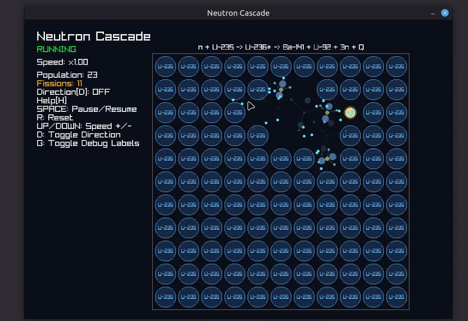

# Neutron Cascade

Neutron Cascade is a C++20 real-time simulation and visualizer of a fission chain reaction.

This project focuses on:
- Deterministic simulation behavior
- Clear separation between the simulation core and rendering
- Repeatable tests
- Benchmark and log analysis workflow

---

## Demo


---

## Core Features
- C++20 simulation core with deterministic RNG (`std::mt19937_64`)
- Double-buffer particle update pipeline (`current->next->swap`)
- Fission event stream consumed by renderer
- Real-time 2D visualization using raylib
- CSV logging for post-run analysis
- Automated tests for reproducibility and invariants

---

## Architecture
### Separation of responsibilities
- `Simulation`:
  - particle movement
  - collision/fission decision logic
  - population/energy statistics
  - fission event generation
- `Renderer` (in `main.cpp`):
  - input handling
  - world-to-screen conversion
  - visual effects and HUD
- `SimulationLogger`:
  - timestamped CSV output in `logs/`
  
Renderer reads simulation state.
Renderer never decides physics behavior.

---

## Build Requirements

- CMake 3.20+
- C++20 compiler (GCC/Clang/MSVC)
- Ninja
- Python 3 (optional, for plotting script)

raylib is fetched automatically by CMake (`FetchContent`).

---

## Build and Run

### Linux
```bash
cmake -S . -B build -G Ninja -DCMAKE_BUILD_TYPE=Release
cmake --build build
./build/neutron_visualizer
```

### Windows (PowerShell)
```bash
cmake -S . -B build -G Ninja
cmake --build build
.\build\neutron_visualizer.exe
```

## Controls
- Space: pause / resume
- R: reset
- Up/Down: increase / decrease simulation speed
- D: toggle direction vectors
- G: toggle generation labels
- H: toggle help panel

## Tests
Run all tests:
```bash
ctest --test-dir build --output-on-failure
```
Current tests:
- reproducibility
- population_cap
- boundary_escape
- reset_behavior
- no_collision_population_constant

## Benchmark
Build and run benchmark:
```bash
cmake --build build --target benchmark_simulation
./build/benchmark_simulation
```

## Plot CSV Logs
Install dependency:
```bash
python3 -m pip install --user matplotlib
```

Plot latest CSV in logs:
```bash
python3 scripts/plot_population.py
```

Plot a specific file:
```bash
python3 scripts/plot_population.py --file logs/<file>.CSV
```
The plot image is saved automatically to docs/population_plot.png each run.

## Known Limitations
- This is a simplified educational model, not a physics-accurate nuclear simulator.
- The simulation is currently 2D-oriented.
- The population cap is a safety guard for memory stability, not a physical law.
- Rendering and simulation are currently frame-driven.

## License
This project is licensed under the MIT License.
See [LICENSE](LICENSE) for details.